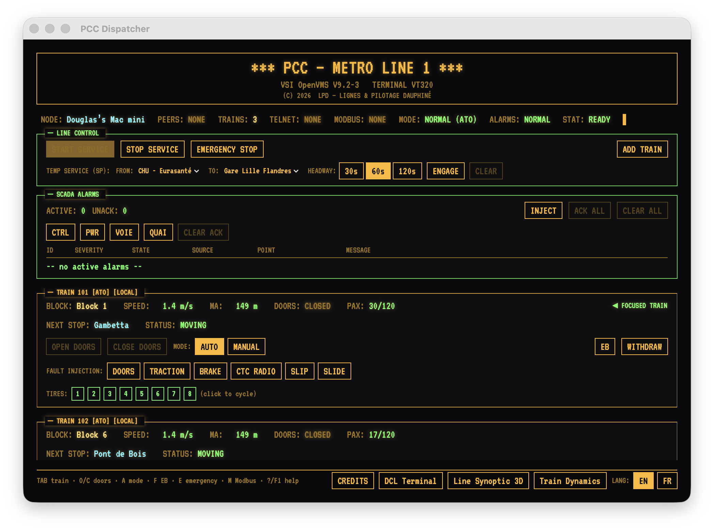
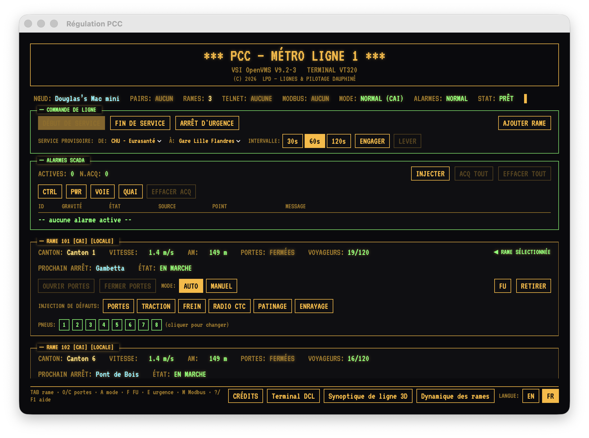

# MetroSystem

A native macOS / SwiftUI **CBTC metro simulator** with a retro VT320 /
OpenVMS aesthetic — a single-process rebuild of the DC CBTC metro simulator
on the [elevatorSystem](https://github.com/lapatatedouce59/elevatorSystem)
retro harness. One app, four windows, bilingual EN / FR throughout, with a
headless cluster daemon and a Modbus TCP interface for external tooling.

English | Français
:---:|:---:
 | 

## Windows

- **PCC Dispatcher** — the poste de commande centralisé: line service,
  arrêt d'urgence général, service-provisoire configurator, the ISA-18.2
  SCADA annunciator (ack / shelve / clear discipline), and a control panel
  per train (doors, ATO/MAN mode, manual-speed desk, emergency brake, fault
  injection — doors, traction, brake, CTC radio, wheel slip/slide — and the
  eight VAL tires).
- **Line Synoptic 3D** — a SceneKit view of the circular VAL line: 10 blocks
  (cantons), 6 Lille stations, colour-coded trains, service-provisoire
  sections dimmed, camera orbit and a follow-train chase mode.
- **DCL Terminal** — a full OpenVMS DCL shell emulation (the elevatorSystem
  engine) with the **LPD VAL-CTRL** layered product: `VALCP SHOW/SET RAME`,
  `SET LIGNE /SP=(1,3,60)`, `MONITOR DYNAMICS`, `MONITOR CLUSTER`, `SHOW
  MODBUS`, `DIAGNOSE`, EDT, MAIL, command procedures, and an interactive
  VMS HELP library. Also reachable over `telnet localhost 2323`.
- **Train Dynamics** — a commissioning-scope window plotting each train's
  speed against the asservissement setpoint.
- **Train Detail** — a dedicated per-rame TCMS synoptic (double-click a
  train card's DETAIL button): a speed dial with the setpoint needle,
  MA / passenger / traction meters, the diagnostic sections, the ATP
  chaîne-de-sécurité, and the eight VAL tires as two bogies of pressure
  gauges. Modelled on the DC CBTC train-detail screen.

See [docs/](docs/README.md) for the detail-window, 3D synoptic and DCL
screenshots.

## Simulation

The DC CBTC model made single-process: a 60 Hz PLC-scan `MetroWorld` where
each train runs the asservissement speed regulation (braking curve +
proportional control + emergency-brake envelope + tire-adhesion / patinage
/ enrayage model) against a movement authority recomputed every scan by the
wayside zone controller, with station dwell, passenger exchange, and
service-provisoire shuttle logic.

## Multi-node networking

Every train carries an `ownerPeerId`. The app discovers other PCC nodes on
the LAN over Bonjour (`_metrosys._tcp`) — another Mac running the app, or
headless **ClusterDaemon** nodes — and shows their trains as **REMOTE** on
the same circular line. Each node's zone controller protects its own trains
against the whole shared picture; exploitation commands (doors, emergency
brake, driving mode, manual speed) forward to the owning node.

```bash
cd ClusterDaemon && swift run metro-clusterd --nodes 2 --trains 2
```

See [ClusterDaemon/README.md](ClusterDaemon/README.md) for the daemon and
the app↔daemon wire-mirror pairs.

## Modbus TCP

A Modbus TCP slave on **`localhost:5020`** exposes live train telemetry,
the chaîne-de-sécurité contacts, and control coils/registers so `mbpoll`,
`pymodbus`, OpenPLC or Node-RED can read and drive trains. Press **M** in
the PCC Dispatcher, or `SHOW MODBUS` in the terminal, for the live map.
Full layout: [docs/modbus-register-map.md](docs/modbus-register-map.md).

## Build & run

The `.xcodeproj` is generated by [XcodeGen](https://github.com/yonaskolb/XcodeGen)
from `project.yml` and is `.gitignore`'d:

```bash
brew install xcodegen             # one-time prerequisite
xcodegen generate                 # regenerate MetroSystem.xcodeproj
open MetroSystem.xcodeproj        # run the MetroSystem scheme

# Or build headless:
xcodebuild -project MetroSystem.xcodeproj -scheme MetroSystem \
           -configuration Debug -destination 'platform=macOS' build
```

Target is macOS 15.0. Three trains seed at launch; press **START SERVICE**
(or type `START LINE` in the DCL terminal) to begin operation. First launch
triggers the macOS local-network privacy prompt — accept it for peer
discovery.

## Ten-second tour (DCL)

```
$ FLEET                              ! fleet table (or FLOTTE)
$ RAME 101                           ! per-train status sheet (or TRAIN 101)
$ VALCP SET RAME 101 /MANUAL         ! manual driving
$ VALCP SET RAME 101 /SPEED=8
$ STOP RAME 101                      ! emergency brake
$ START RAME 101                     ! release
$ VALCP SET LIGNE /SP=(1,3,60)       ! shuttle CHU <-> Gare, 60 s headway
$ VALCP SET LIGNE /NORMAL
$ MONITOR DYNAMICS                   ! live speed-regulation table (Ctrl/Y exits)
$ MONITOR CLUSTER                    ! per-node CPU/mem/IO across peers
$ SHOW MODBUS                        ! Modbus register map
$ SELFTEST                           ! drive every documented verb
$ HELP METRO                         ! worked example; HELP VALCP for reference
```

## Testing

There is no XCTest target. The app's harness is the `SELFTEST` DCL command
(runs in the DCL window or over telnet); the daemon's is
`swift run metro-clusterd --selftest` (a wire-codec round-trip that locks
compatibility with the app). Both run in CI (`.github/workflows/`).

## Language discipline

The UI is strictly bilingual: EN mode shows no French, FR mode shows no
English, with three deliberate in-universe exceptions — the OpenVMS
*system* banner/messages stay English in both modes (real VMS was
English-only); SCADA source/point tags and the OpenVMS DCL verbs are
language-neutral identifiers; and proper nouns (VAL, PCC, the Lille station
names, the LPD vendor name) are never translated.

The **DCL metro command vocabulary follows the interface language** too:
the English short-form aliases (`TRAIN`, `FLEET`, `LINE`, `STATIONS`,
`EMERGENCY`, `RESUME`) resolve only in English mode and the French ones
(`RAME`, `FLOTTE`, `LIGNE`, `GARES`, `URGENCE`, `REPRISE`, `AIDE`) only in
French mode; likewise the `LINE`/`LIGNE` object keyword and the `SET RAME`
fault qualifiers (`/BRAKE` vs `/FREIN`, `/SLIP` vs `/PATINAGE`, …). The
OpenVMS verbs (`SHOW`, `SET`, `MONITOR`, …) and the VALCP product nouns
(`RAME`, `RAMES`, `STATIONS`, `PAX`) are the installed CLI vocabulary and
work in either mode.

## Credits

- **CBTC metro simulation** — Douglas Carmichael, after the DC CBTC
  client/server metro simulator.
- **Retro UI, OpenVMS DCL shell and simulation harness** — adapted from
  [elevatorSystem](https://github.com/lapatatedouce59/elevatorSystem)
  (Amaury Crocquefer; macOS/SwiftUI port Douglas Carmichael).
- VT323 typeface © Peter Hull, SIL Open Font License (`Resources/Fonts/OFL.txt`).

This is a dispatch + visualisation simulator, **not** a safety controller;
nothing here is approved to move a train.
