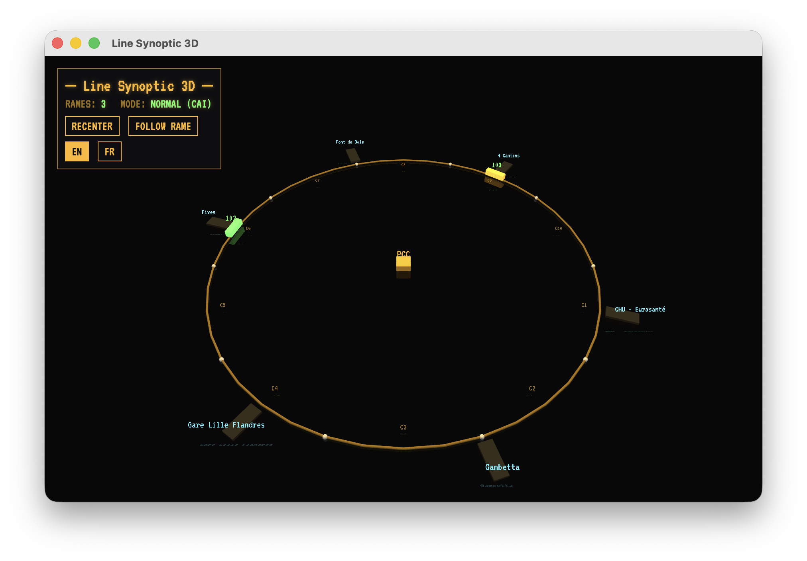
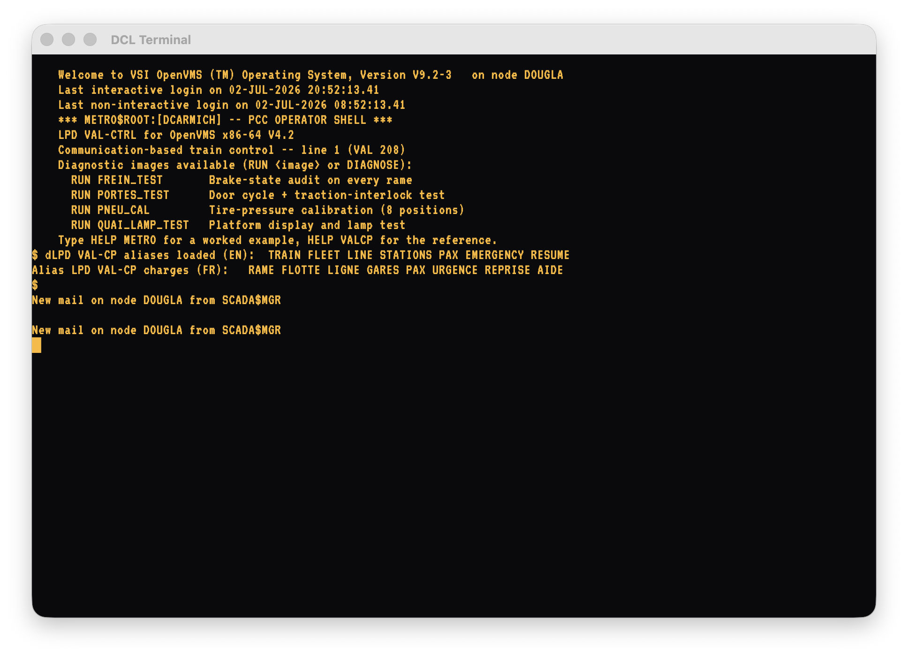

# MetroSystem — screenshots & references

## PCC Dispatcher (bilingual EN / FR)

The poste de commande centralisé: line service, arrêt d'urgence général,
service-provisoire configurator, the ISA-18.2 SCADA annunciator, and a
control panel per train (doors, ATO/MAN mode, manual-speed desk, emergency
brake, fault injection, the eight VAL tires). The whole UI switches between
English and French at runtime — no French leaks into EN mode and no English
into FR mode.

English | Français
:---:|:---:
 | 

## Line Synoptic 3D

The circular VAL line in SceneKit: 10 blocks (cantons), 6 Lille stations,
the PCC hub, colour-coded trains (green moving, amber at platform, red
under emergency brake, cyan in manual), service-provisoire sections dimmed,
camera orbit and a follow-train chase mode.

## DCL Terminal

A full OpenVMS DCL shell emulation with the LPD VAL-CTRL layered product.
The OpenVMS system banner stays English in both language modes (real VMS
shipped English-only); the layered-product content localizes.

## References

- [Modbus TCP register map](modbus-register-map.md) — the full coil /
  discrete-input / holding-register / input-register layout the app exposes
  on `localhost:5020`.
